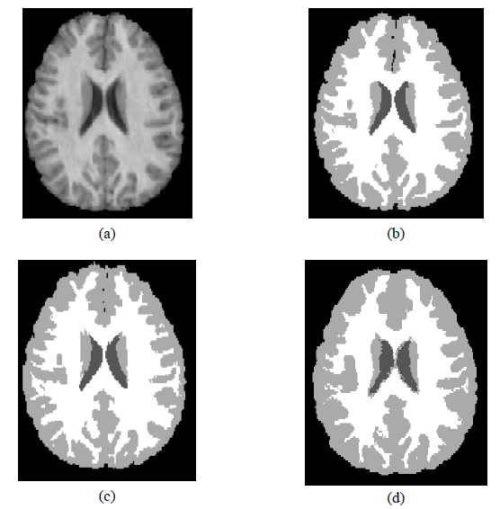

# Brain tissue segmentation using Multi-atlas and Deep learning approaches

The challenge was the final project of the Medical image segmentation course given in the University of Girona for the [MAIA programme](https://maiamaster.udg.edu/).
The final report can be found [here](Misa_final_report.pdf).

In this project, we performed segmentation of the three main brain tissues cerebrospinal fluid (CSF), gray matter (GM) and white matter (WM), from the
brain MRI dataset of IBSR 18. Despite the challenges faced, such as different voxel sizes and intensity inhomogeneities, we were able to achieve successful results using both traditional approaches and deep learning methodologies.

## Authors of the project 
- Ricardo Montoya Del Angel [github](https://github.com/Likalto4) | [linkedin](https://www.linkedin.com/in/ricardo-montoya-del-angel)

- Cansu Yalçın [github](https://github.com/cansuyalcinn) | [linkedin](www.linkedin.com/in/cansuyalcin)

- Alex Chicano [linkedin](https://www.linkedin.com/in/%C3%A0lex-chicano-83291a148/)

## Implementation

We followed two main pipelines; classical and deep learning approaches. 
 
In classical approaches, we applied three main experiments. Firstly, we applied a series of multi-atlas methodologies including most similar atlas, majority voting (mean atlas), weighted voting atlas and top atlasses approaches. Secondly, we applied the Bayesian framework and finally, intensity-based methodologies including, tissue model and the expectation maximization algorithm with different initializations and variations. Among all the experiments from the classical approach, we obtained 0.80, 0.88 and 0.88 mean dice scores in the validation test, for CSF, GM and WM respectively, using the Bayesian model.

In the deep learning section, we experimented with the recent advanced U-net based algorithms. In this case, we applied 3 main architectures, namely, U-net and ResUnet and DenseUnet. Due to the size of the dataset, we decided to apply a patch based approach to train our model. To match the requirements of the semantic segmentation problem, we experimented with several loss functions such as focal loss, dice loss and categorical cross entropy loss.

Overall, we were able to obtain the best results using the DenseUnet model with categorical cross entropy loss function reaching up to **0.84, 0.93 and 0.91** mean dice scores in the validation set for the tissues CSF, GM and WM sequentially.

## Segmentation results

||
| :--: | 
| *Segmentation results for the validation image for IBSR_14 where (a) Original image, (b), Segmentation mask (c), Segmentation using the DenseUnet CE. d) Segmentation using the bayesian model* |
